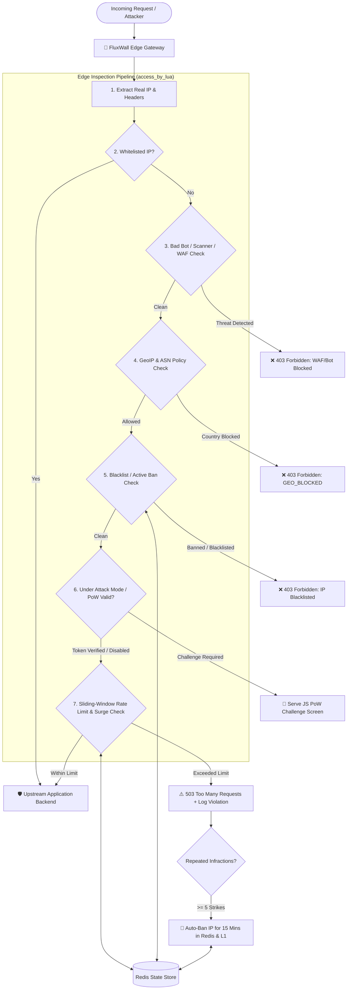

<div align="center">

# 🌊 FluxWall

**High-Performance Layer 7 Anti-DDoS, Adaptive Traffic Shaper & Bot Mitigation Reverse Proxy Gateway**

[](https://openresty.org/)
[](https://nginx.org/)
[](https://luajit.org/)
[](https://nextjs.org/)
[](https://docs.nestjs.com/recipes/terminus)
[](https://redis.io/)
[](https://www.docker.com/)
[](https://prometheus.io/)

[](LICENSE)
[](https://github.com/RaffiDevYT/fluxwall-antiddos)
[](https://github.com/RaffiDevYT/fluxwall-antiddos)
[](https://github.com/RaffiDevYT/fluxwall-antiddos)

**Ultra-fast edge defense built on OpenResty (Nginx + LuaJIT) & Redis to shield web backends from abusive HTTP floods, botnets, scanners, and brute-force attacks.**

[Overview](#-overview) • [Key Features](#-key-features) • [Architecture](#-architecture--request-flow) • [Quick Install](#-quick-install-1-line-vps-installer) • [Web Dashboard](#-web-admin-dashboard-admin) • [Documentation](#-panduan-lengkap-pemasangan-di-vps-linux) • [License](#-license)

---

</div>

## 💡 Overview

**FluxWall** is a modern, enterprise-grade edge security reverse proxy designed to intercept and neutralize malicious Layer-7 traffic before it can ever reach your backend application servers (*PHP, Node.js, Python, Go, Laravel, WordPress, etc.*).

By integrating **OpenResty (Nginx + LuaJIT)** with an asynchronous **Redis 7** backend and **L1 Worker In-Memory Dictionaries (`lua_shared_dict`)**, FluxWall executes request inspection, bot fingerprinting, and rate limiting in **under 0.5 milliseconds** with zero backend CPU/RAM exhaustion.

> [!TIP]
> **Cloudflare Alternative for Self-Hosted Infrastructure**: FluxWall includes a built-in **JavaScript Proof-of-Work (PoW) Challenge ("Under Attack Mode")**, neutralizing 99.9% of automated HTTP flood scripts, Slowloris attacks, and vulnerability scanners.

---

## 🚀 Key Features

| Feature | Description |
| :--- | :--- |
| ⚡ **Sub-Millisecond Latency** | Non-blocking asynchronous LuaJIT execution directly inside Nginx event loops (< 0.5 ms overhead). |
| 🧠 **L1 In-Memory Fast Cache** | `lua_shared_dict` local caching for whitelist/blacklist lookups, offloading Redis during heavy floods. |
| 🛡️ **JavaScript PoW Challenge** | Cloudflare-style *"Under Attack Mode"* with client-side SHA-256 computation and HMAC-signed access cookies. |
| 🌍 **GeoIP & Cloud ASN Filter** | Country whitelist/blacklist with `https://ipinfo.io` API integration & datacenter botnet blocker (AWS, DO, Hetzner). |
| 🤖 **Bad Bot & Scanner Filter** | Drops vulnerability scanners (*sqlmap, nikto, dirbuster, masscan, nmap, exploit probes*) instantly. |
| 💉 **Lightweight WAF Sanitizer** | Fast regex filter for SQL Injection (`UNION SELECT`), XSS (`<script>`), RCE (`eval()`), and Path Traversal (`/etc/passwd`). |
| 🌊 **Adaptive Surge Mode** | Automatically detects global traffic spikes and tightens per-IP limits dynamically until traffic normalizes. |
| 📊 **Next.js Web Admin Dashboard** | Full-Stack Next.js 15 App Router SPA with Chart.js telemetry, 1-click ban controls & `@nestjs/terminus` healthcheck indicators. |
| 🏥 **Terminus Healthchecks (`/api/health`)** | Standardized health indicator JSON evaluating Redis ping, memory heap, process RSS, and gateway socket status. |
| 🔌 **Protected REST API** | Programmatic endpoints (`/api/admin/*`) for SIEM, webhooks, and automated IP list management. |
| 📈 **Prometheus Metrics** | Native `/metrics` scrape endpoint for Prometheus & Grafana monitoring. |
| ⏳ **Sliding Window Rate Limit** | Atomic Redis counters with burst allowances and HTTP method token weights (POST/PUT counts 2x). |
| 🚫 **Automated Temporary Ban** | Offending IPs exceeding violation thresholds are automatically quarantined (default 15 minutes). |
| 🔒 **Fail-Open Resilience** | Gracefully passes legitimate traffic if Redis experiences transient timeouts, preventing SPOF. |

---

## 🏗️ Architecture & Request Flow



---

## ⚡ Quick Install (1-Line VPS Installer)

Install the entire FluxWall stack on any Linux VPS (**Ubuntu, Debian, CentOS, AlmaLinux**) with a **single command**:

```bash
curl -fsSL https://raw.githubusercontent.com/RaffiDevYT/fluxwall-antiddos/main/install.sh | sudo bash
```

> **What the installer automates:**
> 1. ✅ Detects OS and automatically installs **Docker & Docker Compose** if missing.
> 2. ✅ Prompts for your application's upstream backend host/port (*e.g., `host.docker.internal:3000`*).
> 3. ✅ Generates a secure, random **Admin API Secret Key**.
> 4. ✅ Applies **Linux Kernel Anti-DDoS sysctl hardening** for SYN flood protection and socket buffer tuning.
> 5. ✅ Installs the global **`fluxwall` CLI** utility in `/usr/local/bin/fluxwall`.
> 6. ✅ Builds and boots all containers automatically via `docker compose up -d`.

---

## 🛠️ Gateway CLI Management (`fluxwall`)

Manage your edge security directly from your VPS terminal:

```bash
fluxwall status                     # View container health, QPS, and active ban statistics
fluxwall logs                       # Stream live security events and access logs
fluxwall ban 192.168.1.50 600       # Ban an IP temporarily for 10 minutes (600s)
fluxwall unban 192.168.1.50         # Unban an IP immediately
fluxwall whitelist 203.0.113.10     # Add an IP to Whitelist (bypasses all rate limits)
fluxwall blacklist 198.51.100.22    # Add an IP to Permanent Blacklist
fluxwall reload                     # Zero-downtime Nginx/Lua configuration reload
fluxwall restart                    # Restart gateway containers
fluxwall uninstall                  # Cleanly remove all FluxWall containers and files
```

---

## 🖥️ Web Admin Dashboard (`/admin/`)

Access the real-time security dashboard in your browser:
```text
http://YOUR_VPS_IP:8080/admin/   (or https://yourdomain.com/admin/)
```

* **Live Streaming QPS Meter**: Visual real-time graph of global queries per second powered by Chart.js.
* **Surge Defense Badge**: Live visual indicator when adaptive rate-tightening is actively mitigating floods.
* **1-Click IP Management**: Search, inspect remaining TTLs, and unban quarantined IPs with a single click.
* **Dynamic Rule Controls**: Add IPs to Whitelists or Permanent Blacklists in real-time without restarting Nginx.

---

## 🔌 Protected Admin REST API (`/api/admin/*`)

Authenticate using the header `X-Admin-Key: <SECRET_KEY>` or query parameter `?api_key=...`:

| Method | Endpoint | Description |
| :--- | :--- | :--- |
| `GET` | `/api/admin/stats` | Retrieve global QPS, active ban counts, and Surge Mode state |
| `GET` | `/api/admin/bans` | List all quarantined IPs with remaining TTL seconds |
| `POST` | `/api/admin/bans` | Manually ban an IP: `{"ip": "1.2.3.4", "duration_sec": 600, "reason": "Attack"}` |
| `DELETE` | `/api/admin/bans?ip=1.2.3.4` | Unban an IP immediately |
| `GET` | `/api/admin/whitelist` | List all whitelisted IP addresses |
| `POST` | `/api/admin/whitelist` | Whitelist an IP: `{"ip": "203.0.113.5"}` |
| `DELETE` | `/api/admin/whitelist?ip=203.0.113.5` | Remove an IP from Whitelist |
| `GET` | `/api/admin/blacklist` | List all permanently blacklisted IPs |
| `POST` | `/api/admin/blacklist` | Add an IP to Permanent Blacklist |
| `DELETE` | `/api/admin/blacklist?ip=...` | Remove an IP from Blacklist |

---

## 📊 Prometheus Integration (`/metrics`)

Add FluxWall to your `prometheus.yml` configuration:

```yaml
scrape_configs:
  - job_name: 'fluxwall_gateway'
    scrape_interval: 5s
    static_configs:
      - targets: ['YOUR_SERVER_IP:8080']
```

**Exported Metrics:**
* `gateway_http_requests_total{status, protection, method}`
* `gateway_blocked_requests_total{reason}`
* `gateway_surge_mode_active`
* `gateway_global_qps`
* `gateway_active_bans`

---

## 📁 Project Structure

```text
.
├── bin/                        # Binary & Utility Scripts
│   └── fluxwall.sh             # Gateway management CLI tool
├── conf/                       # Nginx Configuration
│   ├── nginx.conf              # Main reverse proxy configuration & shared memory zones
│   └── mime.types              # MIME types definitions
├── dashboard/                  # Full-Stack Next.js 15 Cyber Defense Dashboard
│   ├── src/                    # App Router, Terminus health API, components & lib
│   ├── Dockerfile              # Multi-stage standalone Next.js build
│   └── package.json
├── docker/                     # Mock backend container
│   └── backend/
│       └── server.js
├── docs/                       # Comprehensive Documentation
│   └── TUTORIAL_VPS.md         # Full manual Linux VPS deployment guide
├── lua/                        # Modular Lua Security Engine
│   ├── admin_api.lua           # Protected Admin REST API router
│   ├── auto_ban.lua            # Infraction tracker & auto-ban trigger
│   ├── blacklist.lua           # Blacklist & temporary ban verifier
│   ├── bot_filter.lua          # Bad bot, scanner, and WAF exploit sanitizer
│   ├── challenge.lua           # JavaScript PoW challenge generator & HMAC verifier
│   ├── config.lua              # Centralized configuration & thresholds
│   ├── gateway.lua             # Master access_by_lua pipeline orchestrator
│   ├── geoip.lua               # GeoIP country resolver & ipinfo.io integration
│   ├── logger.lua              # Structured JSON security event logger
│   ├── metrics.lua             # Prometheus metrics collector & exporter
│   ├── rate_limiter.lua        # Sliding-window rate limiter with method multipliers
│   ├── redis_pool.lua          # Safe Redis connection pool with keepalive & fail-open
│   ├── surge_protector.lua     # Global QPS tracker & adaptive rate scaler
│   └── whitelist.lua           # IP whitelist fast bypass verifier
├── scripts/                    # Automation Scripts
│   ├── install.sh              # 1-Line automated VPS installer
│   └── uninstall.sh            # Clean uninstaller script
├── test/                       # Automated Test Suites
│   ├── test_rate_limit.ps1     # PowerShell automated test suite
│   └── test_rate_limit.sh      # Bash automated test suite
├── Dockerfile                  # Custom OpenResty Docker build
├── docker-compose.yml          # Multi-container stack (Gateway, Redis, Backend)
├── install.sh                  # Quick install entrypoint
├── uninstall.sh                # Quick uninstall entrypoint
├── LICENSE                     # MIT License
└── README.md
```

---

## 🧪 Testing & Verification

Execute the automated test suite to verify healthchecks, bad bot blocking, WAF sanitization, GeoIP headers, and rate limiting:

```bash
# On Linux / macOS:
bash test/test_rate_limit.sh

# On Windows (PowerShell):
.\test\test_rate_limit.ps1
```

---

## 📄 License

This project is licensed under the **MIT License** - see the [LICENSE](LICENSE) file for details.  
Copyright (c) 2026 [RaffiDevYT](https://github.com/RaffiDevYT).
